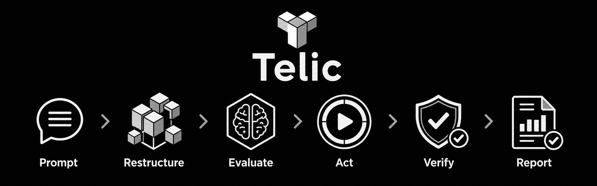

<div align="center">

# Telic

**Rough request in. Evidence-backed workflow out.**

[](https://www.npmjs.com/package/telic-mcp)

[](https://www.typescriptlang.org/)
[](https://modelcontextprotocol.io/)
[](LICENSE)



**A local workflow compiler and safety layer for coding agents.**  
**No Telic cloud. No Telic model API key. Uses your host’s active model.**

[Features](#-features) · [Tech stack](#️-tech-stack) · [Architecture](#️-architecture) · [Privacy](#-privacy) · [Accuracy](#-accuracy--how-verification-works) · [Install](#-install-and-use) · [Codex + GPT-5.6](#built-with-codex-and-gpt-56)

</div>

---

Telic is an opt-in workflow plugin, agent workflow compiler, and safety layer for coding agents. Give it a rough request. Telic turns that request into structured work, keeps the agent inside your permissions, checks the result, and reports only what the evidence supports.

**Prompt. Restructure. Evaluate. Act. Verify. Report.**

## Why Telic

| A normal agent session | A Telic workflow |
| --- | --- |
| A vague request can expand silently | Intent, scope, and permissions become explicit |
| “Done” may be only an agent claim | Completion claims must reference evidence |
| Review can continue without a boundary | Contract revision and remediation are bounded |
| Missing tools can invite guesses | Unavailable checks remain clearly unverified |

Telic gives the coding agent a workflow spine. It does not replace the agent.

## ✨ Features

| Feature | Description |
| --- | --- |
| 🧭 **Rough-request compiler** | Turns `Telic: …` into inspectable roles, requirements, and handoffs |
| 🔐 **Permission modes** | `report_only`, `plan_only`, `analyze_only`, `fix_only`, `analyze_and_fix` |
| 🧾 **Evidence-backed reports** | Final claims must cite recorded evidence, not vibes |
| 🧱 **Strict protocol** | Zod v4 schemas, camelCase bodies, `schemaVersion: "1.0"` |
| 🗂️ **Local run ledger** | SQLite metadata + immutable SHA-256 artifact bodies |
| 📦 **Bounded repo grounding** | Git / ripgrep / filesystem inventory with budgets and secret heuristics |
| 🔌 **Codex plugin + MCP** | Reference Git marketplace plugin and portable `telic-mcp` npm package |
| 🧩 **Host adapters** | Preview packs for Claude Code, Cursor, Antigravity, Kiro, Cline, Roo |
| 🛑 **Missing permission = denial** | Telic does not silently broaden authority |

## 🛠️ Tech stack

| Layer | Technology | Version |
| --- | --- | --- |
| Runtime | Node.js | `>=24.15.0` |
| Language | TypeScript | 7.0.x |
| Protocol schemas | Zod | 4.4.3 |
| MCP SDK | `@modelcontextprotocol/sdk` | 1.29.0 |
| Ledger | Node.js `node:sqlite` (`DatabaseSync`) | built-in |
| Artifact integrity | SHA-256 content-addressed store | local |
| Bundle | esbuild | 0.28.1 |
| Tests | Vitest + `@vitest/coverage-v8` | 4.1.10 |
| Format | Prettier | 3.9.5 |
| npm package | `telic-mcp` | 0.1.1 |
| Website | Next.js + React | 16.2.x / 19.2.x |
| Site styling | Tailwind CSS | 4.3.x |

## 🏗️ Architecture

```text
Developer
   │
   ▼
Host skill / command / MCP prompt
   │
   ▼
Local STDIO MCP  (@telic/mcp)
   ├─ RunController   (@telic/core)     phases, budgets, permissions
   ├─ Repository grounder (@telic/context)
   ├─ SQLite ledger + SHA-256 bodies
   └─ Protocol validation (@telic/protocol)
   │
   ▼
Host model authors semantic artifacts
   │
   ▼
Controller accepts or rejects on evidence rules
```

| Package | Role |
| --- | --- |
| `@telic/protocol` | Strict artifact schemas and parsing |
| `@telic/core` | Deterministic controller, permissions, ledger |
| `@telic/context` | Bounded repository inventory and selection |
| `@telic/mcp` | Nine local MCP tools + `telic_workflow` prompt |
| `@telic/cli` / `telic-mcp` | Doctor, status, trace, artifact, mcp commands |
| `plugins/telic` | Codex reference plugin + bundled MCP server |
| `adapters/` | Source-preview packs for other hosts |

Semantic reasoning stays in the host model. Deterministic software owns workflow state, schema validation, bounded context, immutable storage, and observable handoffs. The controller never calls a model.

## 🔒 Privacy

- ✅ No Telic-hosted service, accounts, ads, or Telic-controlled network backend
- ✅ Runtime is local STDIO. State lives outside the repo in OS user-state storage
- ✅ No telemetry in the Telic runtime
- ✅ No separate Telic model API key. Work uses the host’s active model under that host’s policy
- ✅ Selected source and evidence can still be sensitive. Review [PRIVACY.md](PRIVACY.md) and [SECURITY.md](SECURITY.md)
- ✅ Secret scanning is heuristic. Do not ground repos you are unwilling to store locally

## 🎯 Accuracy / how verification works

Telic optimizes for **honest completion**, not fake confidence scores.

| Step | What Telic enforces | What it does **not** claim |
| --- | --- | --- |
| Frame | Scenario and requirements become explicit artifacts | Perfect understanding of every repo |
| Bound | Mode and permissions gate what may change | Interception of every host-native shell/editor action |
| Ground | Context selection is budgeted, path-contained, and digest-tracked | A dedicated enterprise secret scanner |
| Execute | Allowed work stays inside the approved contract | That the host model cannot be influenced by untrusted text |
| Verify | Completion needs typed evidence and rule coverage | That unavailable checks were somehow “fine” |
| Report | Unsupported claims stay unverified or blocked | A guaranteed correct fix without evidence |

**Honest limits**

- Host-native tools that bypass MCP are outside Telic’s call path. Prevention still needs host sandboxing and approvals.
- Same-user OS access can rewrite local ledger files together. Use OS permissions for stronger separation.
- Preview adapters prove package shape and protocol handshake, not every host’s marketplace lifecycle.
- Telic is a public preview. See [docs/STATUS.md](docs/STATUS.md).

## From rough request to verified result

Start with the way people naturally ask for help:

```text
Telic: Is the profession recommendation algorithm flawed, and are the school
recommendations appropriate for each profession? Analyze only. Do not change files.
```

Telic turns that into an inspectable workflow:


The workflow uses five logical roles:

1. **Scenario author** understands the repository and frames the real problem.
2. **Task compiler** converts that understanding into clear requirements.
3. **Quality controller** checks scope, permissions, and completion criteria.
4. **Executor** investigates, plans, or changes the project when allowed.
5. **Release auditor** verifies the evidence before reporting back.

These roles can run serially through the active host model. Telic does not need five hosted models or five external API calls.

## 🚀 Install and use

Telic requires Node.js `>=24.15.0`. Open the setup that matches your coding host. The portable request form is `Telic: <your request>`; each host also has its own technical fallback when natural activation is unavailable.

<details open>
<summary><strong>Codex plugin</strong></summary>

You need Git and a current
[Codex CLI](https://learn.chatgpt.com/docs/codex/cli) with plugin support.

```bash
node --version
git --version
codex --version
codex plugin marketplace add Dukeabaddon/Telic --json
codex plugin add telic@dukeabaddon-telic --json
codex plugin list --json
codex mcp list --json
```

Restart Codex or reload its IDE extension. Start a new chat, then write:

```text
Telic: investigate why this project is not talking to its API. Analyze only.
```

The plugin includes the Telic skill and local MCP server. Do not add a second
Telic MCP server manually. If natural activation is unavailable, select Telic
through `/skills` or use `$telic:telic`.

</details>

<details>
<summary><strong>Portable npm CLI and MCP server</strong></summary>

Run Telic without a permanent global installation:

```bash
npx -y telic-mcp doctor --json
```

Or install the CLI globally:

```bash
npm install -g telic-mcp
telic doctor --json
```

A generic STDIO MCP client can launch Telic with:

```json
{
  "mcpServers": {
    "telic": {
      "command": "npx",
      "args": ["-y", "telic-mcp", "mcp"],
      "env": {
        "TELIC_REPOSITORY_ROOT": "/absolute/path/to/your-project"
      }
    }
  }
}
```

On Windows, use an escaped absolute path in JSON:

```json
{
  "mcpServers": {
    "telic": {
      "command": "npx",
      "args": ["-y", "telic-mcp", "mcp"],
      "env": {
        "TELIC_REPOSITORY_ROOT": "C:\\Users\\you\\source\\repos\\your-project"
      }
    }
  }
}
```

Run `npx -y telic-mcp doctor --json` before connecting the server. Node.js
`24.15.0` or later is required. Node `24.11.0`, for example, is not supported.

The npm package provides Telic's deterministic tools and portable workflow
prompt. Your host still needs a skill, command, or equivalent workflow driver.

</details>

<details>
<summary><strong>Claude Code, Cursor, Antigravity, Kiro IDE/CLI, Cline, and Roo Code</strong></summary>

Telic includes preview source adapters for these hosts. Kiro IDE and Kiro CLI
use separate packs. Each host stores skills, commands, and MCP configuration
differently, so setup is host-specific.

See [adapter setup](docs/ADAPTERS.md) for the correct files and activation
syntax. Do not copy an adapter over existing configuration without reviewing
the paths first.

</details>

For troubleshooting, removal, source builds, and state configuration, see the
complete [installation guide](docs/INSTALLATION.md).

## Choose what Telic may do

State the boundary in normal language:

| Mode | What Telic may do |
| --- | --- |
| `report_only` | Explain supplied facts or existing results |
| `plan_only` | Produce a plan without executing it |
| `analyze_only` | Investigate without changing files or runtime state |
| `fix_only` | Apply a known correction inside the approved scope |
| `analyze_and_fix` | Diagnose first, then fix an evidenced root cause |

Missing permission is denial. Telic does not silently broaden your request.

Use Telic for ambiguous diagnoses, risky changes, security-sensitive work, or anything needing a clear evidence trail. Skip it for simple questions, typo fixes, formatting, and obvious one-file edits.

## Local by design

Telic runs locally through STDIO and stores its run ledger outside your repository. It does not provide a hosted model service or send work to a Telic cloud. Selected source and submitted evidence can still be sensitive, so review [Security](SECURITY.md) and [Privacy](PRIVACY.md) before using private projects.

## Project status

Telic is a public preview.

| Distribution | Support |
| --- | --- |
| Codex Git marketplace plugin | Available |
| npm package `telic-mcp` | Published |
| Additional host adapters in `adapters/` | Preview |

Read the [current implementation status](docs/STATUS.md) for exact technical boundaries.

## Built with Codex and GPT-5.6

Telic was built through an iterative author–Codex collaboration during OpenAI
Build Week. The author set the product direction, selected the evidence and
permission boundaries, tested real host setups, and made the final decisions.
Codex with GPT-5.6 turned those decisions into code, tests, packaging, website
work, and release documentation.

The working method was deliberately dialectical: each promising idea was
challenged against its cost, safety, and portability before becoming part of
the product.

| Initial direction                                        | Challenge                                                         | Product decision                                                            |
| -------------------------------------------------------- | ----------------------------------------------------------------- | --------------------------------------------------------------------------- |
| A hosted prompt-engineering lab with many agents         | Extra accounts, API costs, and friction weaken developer adoption | A local workflow compiler that uses the coding host's active model          |
| An agent that acts as soon as it understands the request | Ambiguous work can silently exceed the user's authority           | Explicit modes, immutable handoffs, and missing-permission denial           |
| Five separate model agents                               | More model calls do not guarantee clearer responsibility          | Five logical roles that a host can run serially or with native subagents    |
| Broad cross-host claims                                  | A configuration file is not evidence of a working lifecycle       | A Codex reference plugin, preview adapters, and explicit support boundaries |

Codex was used end to end to compare architectures, implement the protocol and
packages, add focused tests, audit permission and artifact behavior, diagnose
installation failures, incorporate tester feedback, prepare npm/plugin assets,
and build the public website. The author continuously supplied the product
intent, approved tradeoffs, tested in real projects and IDEs, and rejected
claims that could not be demonstrated. This loop shaped Telic itself:

```text
idea -> challenge -> evidence -> implementation -> test -> review -> revision -> release
```

The result is not a generated demo alone. It is a tested local control plane,
an installable Codex plugin, a published npm package, and a public product
experience with documented limits.

## Develop Telic

```bash
git clone https://github.com/Dukeabaddon/Telic.git
cd Telic
npm ci
npm run check
```

See [Contributing](CONTRIBUTING.md) for the artifact-first workflow.

## Documentation

- [Installation](docs/INSTALLATION.md)
- [Example run](docs/EXAMPLE_RUN.md)
- [Architecture](docs/ARCHITECTURE.md)
- [Protocol](docs/PROTOCOL.md)
- [API reference](docs/API.md)
- [Adapter setup](docs/ADAPTERS.md)
- [Current status](docs/STATUS.md)
- [Security](SECURITY.md)
- [Privacy](PRIVACY.md)

Use [GitHub Issues](https://github.com/Dukeabaddon/Telic/issues) for
reproducible, non-sensitive defects.

## License

Telic is released under the [MIT License](LICENSE).
