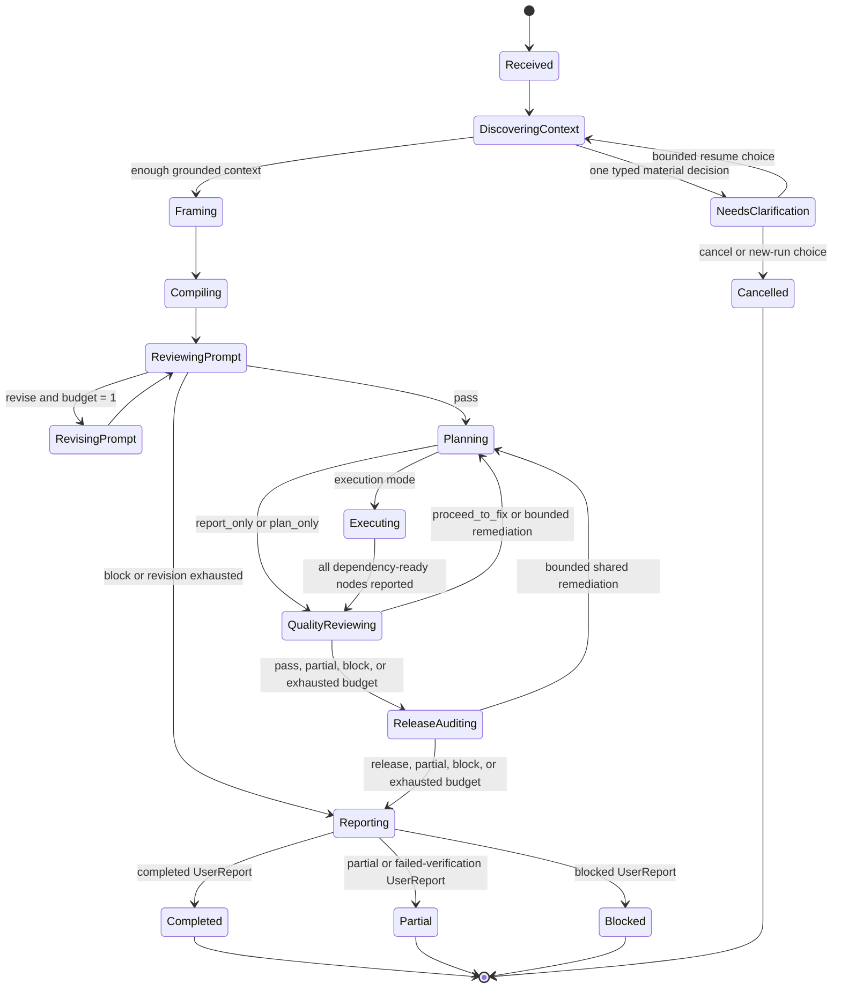

PROTOCOL.md [1045L]

# Telic Protocol

**Status:** Conceptual protocol with an executable `1.0` schema implementation.
... [lean-ctx: omitted 3 lines]
Most YAML blocks below intentionally retain readable snake_case conceptual
... [lean-ctx: omitted 2 lines]
`schemaVersion: "1.0"`. The controller implements the vertical slice described
in [STATUS.md](STATUS.md); statements using MUST below may still describe a
... [lean-ctx: omitted 1 lines]

## 1. Purpose

Telic compiles an imprecise user request into a permission-bounded,
repository-grounded workflow, records evidence from execution, reviews the work,
... [lean-ctx: omitted 4 lines] 2. **Prompt and Task Compiler (Agent 2)** creates an executable task contract.
... [lean-ctx: omitted 1 lines] 4. **Executor (Agent 4)** performs the authorized investigation or work. 5. **Release Auditor and Reporter (Agent 5)** independently checks user fidelity
... [lean-ctx: omitted 2 lines]
run them in separate native subagent contexts, serially in one model session, or
... [lean-ctx: omitted 4 lines]
artifacts and traces, validates schemas and transitions, calculates effective
... [lean-ctx: omitted 1 lines]

## 2. Normative language

The terms **MUST**, **MUST NOT**, **SHOULD**, **SHOULD NOT**, and **MAY** describe
protocol requirements. They do not imply that an implementation exists today.

## 3. Core invariants

- The original user message MUST be stored unchanged and remain addressable.
- A generated scenario MUST NOT silently replace the user's request.
  ... [lean-ctx: omitted 6 lines]
- Agents MUST communicate through typed artifacts. A downstream role MAY receive
  ... [lean-ctx: omitted 2 lines]
- A completed result MUST be traceable to acceptance criteria and evidence.
- Every phase projection MUST retain the transitive eligible references needed to
  interpret its mandatory inputs; it MUST fail rather than silently truncate that
  ... [lean-ctx: omitted 1 lines]
- Structured decision summaries MAY be recorded. Hidden chain-of-thought MUST NOT
  ... [lean-ctx: omitted 4 lines]

## 4. Execution topology

### 4.1 Serial host execution

A host without native subagents uses one model session:

```text
host model -> begin_phase(A1) -> submit ProblemFrame
host model -> begin_phase(A2) -> submit TaskContract
host model -> begin_phase(A1_REVIEW) -> submit PromptReview
host model -> begin_phase(A3_PLAN) -> submit WorkPlan
host model -> begin_phase(A4) -> submit WorkResult
host model -> begin_phase(A3_REVIEW) -> submit QualityReview
host model -> begin_phase(A5) -> submit ReleaseAudit
host model -> begin_phase(A5_REPORT) -> submit UserReport
```

... [lean-ctx: omitted 4 lines]

### 4.2 Native subagent execution

Protocol v1 and the current controller accept deterministic serial WorkPlans
... [lean-ctx: omitted 1 lines]
adapters can enforce concurrency, depth, tools, context, and output boundaries.
... [lean-ctx: omitted 1 lines]

### 4.3 MCP boundary

The implemented MCP surface is a state and artifact boundary. Version `0.2.0`
... [lean-ctx: omitted 1 lines]
`telic_get_next_action`, `telic_submit_artifact`, `telic_cancel_run`,
... [lean-ctx: omitted 3 lines]
The optional `telic_workflow` MCP prompt gives compatible hosts a portable
... [lean-ctx: omitted 3 lines]
MCP sampling or an external model key MUST NOT be required for the core workflow.

## 5. Identifiers and references

Every run, artifact, trace event, acceptance criterion, work node, and review
... [lean-ctx: omitted 15 lines]

```yaml
ArtifactRecord:
  id: task-contract-01
  run_id: run-01
  type: TaskContract
  schema_version: "1.0"
  producer: agent-2
  created_at: 2026-07-15T10:00:00Z
  sha256: sha256:3b7b...
  source_refs: []
  redaction: none
  body: {}
```

## 6. User intent modes

The selected mode is an authorization boundary, not merely a prompt label.
Unclear requests MUST NOT be silently upgraded to a more permissive mode.
... [lean-ctx: omitted 2 lines]
| `report_only` | Explain existing facts or prior results | Read supplied artifacts; no new runtime investigation or mutation |
| `plan_only` | Produce an actionable plan without carrying it out | Read repository/context as authorized; no task execution or mutation |
| `analyze_only` | Investigate and diagnose | Read repository, browser, logs, and runtime; no edits or restarts |
| `fix_only` | Apply a known, explicitly scoped correction | Minimal preflight, scoped change, and verification only |
| `analyze_and_fix` | Diagnose, then correct a supported cause | Read-only analysis followed by bounded authorized mutation and verification |
... [lean-ctx: omitted 3 lines]
Mode defaults MAY be narrowed by a contract. They MUST NOT be broadened without
... [lean-ctx: omitted 5 lines]

## 7. Permission model

### 7.1 Effective permission

For every tool call, effective permission is the intersection of:

```text
host/system policy
  intersect user authorization
  intersect applicable repository policy
  intersect TaskContract permissions
  intersect WorkPlan node permissions
  intersect current tool capability
```

... [lean-ctx: omitted 1 lines]

### 7.2 Permission vocabulary

Implementations SHOULD express permissions as typed capabilities with optional
... [lean-ctx: omitted 1 lines]

```yaml
permissions:
  repository:
    read: ["**"]
    write: ["infra/compose.dev.yml"]
  shell:
    inspect: true
    execute_allowlist: ["npm test"]
  runtime:
    inspect: ["web", "api"]
    restart: ["api"]
  browser:
    inspect: true
    mutate_state: false
  network:
    read_domains: []
    external_write: false
  subagents:
    spawn: true
    maximum_children: 3
    maximum_depth: 1
```

... [lean-ctx: omitted 14 lines]

## 8. Artifact types

The fields below define minimum logical content in conceptual YAML. They do not
replace the finalized camelCase Zod serialization contract.

### 8.1 `RunEnvelope`

Created by the host adapter and controller before reasoning begins.

```yaml
RunEnvelope:
  schema_version: "1.0"
  run_id: run-01
  created_at: 2026-07-15T10:00:00Z
  original_request_ref: artifact://run-01/user-message-01
  followup_request_refs: []
  requested_mode: analyze_and_fix
  status: active
  working_context:
    repository_root: /workspace/example
    active_files: []
    applicable_rule_refs: []
  host:
    name: codex
    native_subagents: available
    capabilities:
      [
        repository.read,
        repository.write,
        shell.inspect,
        shell.execute,
        browser.inspect,
      ]
  authorization:
    granted:
      repository: { read: ["**"], write: ["apps/web/**"], delete: [] }
      shell: { inspect: true, execute_allowlist: ["npm test"] }
      runtime: { inspect: [], restart: [] }
      browser: { inspect: true, mutate_state: false }
      network: { read_domains: [], external_write: false }
      subagents: { spawn: false, maximum_children: 0, maximum_depth: 0 }
    denied:
      repository: { read: [], write: [], delete: [] }
      shell: { inspect: false, execute_allowlist: [] }
      runtime: { inspect: [], restart: [] }
      browser: { inspect: false, mutate_state: false }
      network: { read_domains: [], external_write: false }
      subagents: { spawn: false, maximum_children: 0, maximum_depth: 0 }
  budgets:
    prompt_revisions: 1
    post_execution_remediations: 1
    maximum_parallel_workers: 3
    maximum_subagent_depth: 1
  policy_refs: []
```

... [lean-ctx: omitted 2 lines]

### 8.2 Controller and context artifacts

The controller creates deterministic artifacts that tell the host what may happen
... [lean-ctx: omitted 1 lines]

```yaml
NextAction:
  id: action-01
  run_id: run-01
  created_at: 2026-07-15T10:00:01Z
  kind: phase
  phase: agent_1_frame
  logical_role: scenario_author
  instruction_ref: artifact://system/roles/scenario-author-v1
  input_refs:
    - artifact://run-01/user-message-01
  context_manifest_ref: artifact://run-01/context-manifest-01
  required_output_type: ProblemFrame
  required_output_schema: { type: object }
  additional_output_schemas: {}
  work_node_id: null
  effective_permissions:
    repository: { read: [], write: [], delete: [] }
    shell: { inspect: false, execute_allowlist: [] }
    runtime: { inspect: [], restart: [] }
    browser: { inspect: false, mutate_state: false }
    network: { read_domains: [], external_write: false }
    subagents: { spawn: false, maximum_children: 0, maximum_depth: 0 }
  remaining_budgets:
    prompt_revisions: 1
    post_execution_remediations: 1
    maximum_parallel_workers: 1
    maximum_subagent_depth: 0
  stop_conditions: []
  rationale_summary: The controller selected the next legal phase.
```

... [lean-ctx: omitted 10 lines]

```yaml
ContextManifest:
  id: context-manifest-01
  run_id: run-01
  repository_fingerprint:
    head_commit: null
    dirty_worktree_hash: sha256:...
  pinned_refs:
    - artifact://run-01/user-message-01
    - repo://AGENTS.md
  candidates:
    - id: context-api
      ref: repo://apps/web/src/lib/api.ts
      locations: [getProjects]
      content_hash: sha256:...
      byte_size: 13200
      decision: selected
      selection_reason: Defines the request path named by the symptom.
      path: apps/web/src/lib/api.ts
      score: 100
      pinned: false
  derived_refs: []
  excluded_candidate_summaries: []
  inventory_source: git
  warnings: []
  budget:
    maximum_files: 32
    maximum_file_bytes: 1000000
    maximum_total_bytes: 1000000
    maximum_inventory_files: 10000
    candidate_files: 1
    selected_files: 1
    estimated_tokens: 4200
    selected_bytes: 13200
```

... [lean-ctx: omitted 41 lines]

### 8.3 `ProblemFrame`

Agent 1's grounded interpretation of real project work.

```yaml
ProblemFrame:
  id: frame-01
  original_request_ref: artifact://run-01/user-message-01
  intent_mode: analyze_and_fix
  goal: Identify why the React client cannot retrieve project data.
  known_facts:
    - claim: The dashboard loads and remains offline.
      provenance: user
      source_ref: artifact://run-01/user-message-01
  inferences: []
  unknowns: []
  scope:
    include: []
    exclude: []
  constraints: []
  non_goals: []
  applicable_rule_refs: []
  draft_acceptance_criteria:
    - id: AC-DIAGNOSIS
      stage: diagnosis
      requirement: Identify the failed boundary with direct evidence.
      evidence_required: [browser_or_runtime_observation]
    - id: AC-COMPLETION
      stage: completion
      requirement: Correct the supported cause and pass focused verification.
      evidence_required: [diff, test_output]
  clarification:
    required: false
    reason: null
  rationale_summary: The request and selected repository context define a bounded diagnosis-and-fix task.
```

... [lean-ctx: omitted 5 lines]

### 8.4 `ScenarioSpec`

`ScenarioSpec` is a human-readable presentation derived from a `ProblemFrame`, or
... [lean-ctx: omitted 1 lines]

```yaml
ScenarioSpec:
  id: scenario-01
  problem_frame_ref: artifact://run-01/frame-01
  title: Frontend-to-API communication failure
  narrative: The dashboard renders but project data does not appear.
  actor: Developer investigating a local monorepo
  observable_symptoms: []
  desired_outcome: Evidence-backed diagnosis
  source_map: []
  prompt_readiness_rubric_ref: artifact://system/rubrics/contract-readiness-v1
  rationale_summary: This presentation is derived from the authoritative frame.
```

... [lean-ctx: omitted 5 lines]

### 8.5 `TaskContract`

Agent 2 compiles the approved frame into the source of truth for execution.

```yaml
TaskContract:
  id: contract-01
  version: 1
  original_request_ref: artifact://run-01/user-message-01
  problem_frame_ref: artifact://run-01/frame-01
  intent_mode: analyze_and_fix
  objective: Identify the failed communication boundary, then correct only the supported cause.
  scope:
    include: []
    exclude: []
  constraints: []
  non_goals: []
  context_refs: [repo://apps/web/src/lib/api.ts]
  rule_refs: []
  permissions:
    repository:
      read: ["**"]
      write: ["apps/web/**"]
      delete: []
    shell:
      inspect: true
      execute_allowlist: ["npm test"]
    runtime:
      inspect: [local]
      restart: []
    browser:
      inspect: true
      mutate_state: false
    network:
      read_domains: [localhost]
      external_write: false
    subagents:
      spawn: false
      maximum_children: 0
      maximum_depth: 0
  acceptance_criteria:
    - id: AC-DIAGNOSIS
      stage: diagnosis
      requirement: Identify the failed boundary with direct evidence.
      evidence_required: [browser_network_or_equivalent]
    - id: AC-COMPLETION
      stage: completion
      requirement: Correct the supported cause and pass focused verification.
      evidence_required: [diff, test_output]
  required_outputs: [Evidence-backed diagnosis, scoped correction report]
  verification_requirements:
    - id: VR-DIAGNOSIS
      stage: diagnosis
      description: Capture the failing browser boundary.
      required: true
      capability: browser.inspect
      fallback: null
    - id: VR-COMPLETION
      stage: completion
      description: Run the focused test command after the correction.
      required: true
      capability: shell.execute
      fallback: null
  stop_conditions: []
  assumptions: []
  unresolved_questions: []
  rationale_summary: The contract preserves the frame and existing authorization.
```

... [lean-ctx: omitted 10 lines]

### 8.6 `PromptReview`

Agent 1 evaluates Agent 2's contract against the frozen frame and rubric.

```yaml
PromptReview:
  id: prompt-review-01
  target_ref: artifact://run-01/contract-01
  rubric_id: contract-readiness-v1
  revision_number: 0
  coverage:
    - source_ref: artifact://run-01/user-message-01
      contract_fields: [objective, intentMode]
      status: covered
    - source_ref: artifact://run-01/frame-01
      contract_fields:
        [scope, constraints, nonGoals, acceptanceCriteria, ruleRefs]
      status: covered
    - source_ref: artifact://run-01/contract-01
      contract_fields:
        [
          permissions,
          contextRefs,
          requiredOutputs,
          verificationRequirements,
          stopConditions,
          assumptions,
          unresolvedQuestions,
        ]
      status: covered
  dimension_scores:
    intent_fidelity: 80
    repository_grounding: 80
    constraints_and_permissions: 80
    testable_acceptance: 80
    execution_feasibility: 80
    context_efficiency: 80
  overall_score: 80
  hard_gates:
    - id: HG-AUTHORITY
      passed: true
      description: Contract stays within immutable authorization.
      evidence_refs: [artifact://run-01/contract-01]
      rationale_summary: Contract permissions are bounded by the run envelope.
  findings: []
  decision: pass # pass | revise | block
  rationale_summary: The contract is fully covered and clears the v1 threshold.
```

... [lean-ctx: omitted 10 lines]

### 8.7 `WorkPlan`

Agent 3 compiles an approved contract into a bounded directed acyclic graph.

```yaml
WorkPlan:
  id: plan-01
  task_contract_ref: artifact://run-01/contract-02
  execution_mode: serial
  nodes:
    - id: browser-investigation
      logical_role: executor.browser-investigator
      objective: Capture the failed browser boundary.
      depends_on: []
      input_refs: []
      context_refs: [repo://apps/web/src/lib/api.ts]
      allowed_tools: [browser.inspect]
      required_capabilities: [browser.inspect]
      permissions:
        repository: { read: [], write: [], delete: [] }
        shell: { inspect: false, execute_allowlist: [] }
        runtime: { inspect: [], restart: [] }
        browser: { inspect: true, mutate_state: false }
        network: { read_domains: [], external_write: false }
        subagents: { spawn: false, maximum_children: 0, maximum_depth: 0 }
      output_type: WorkResult
      acceptance_criteria: [AC-DIAGNOSIS]
      stop_conditions: []
      budgets:
        maximum_tool_calls: 8
        maximum_children: 0
  join_rules: []
  global_budgets:
    maximum_tool_calls: 8
    maximum_parallel_workers: 1
    maximum_subagent_depth: 0
  plan_validation: valid
  rationale_summary: This serial node is the smallest read-only diagnosis plan.
```

... [lean-ctx: omitted 19 lines]

### 8.8 `WorkResult`

Agent 4 reports work without declaring final acceptance.

```yaml
WorkResult:
  id: result-01
  work_plan_ref: artifact://run-01/plan-01
  node_id: browser-investigation
  status: completed # completed | partial | blocked | failed
  observations:
    - id: OBS-BOUNDARY
      text: The browser request is rejected before the API handler runs.
      status: observed
      evidence_refs: [artifact://run-01/evidence-browser-01]
      confidence: 1
  inferences: []
  actions:
    - id: ACTION-BROWSER
      capability: browser.inspect
      target: localhost/dashboard
      mutating: false
      status: completed
      evidence_refs: [artifact://run-01/evidence-browser-01]
      rationale_summary: Captured the failing request without changing browser state.
  files_changed: []
  tool_event_refs: []
  evidence_refs: [artifact://run-01/evidence-browser-01]
  test_results: []
  acceptance_coverage:
    - criterion_id: AC-DIAGNOSIS
      status: pass
      evidence_refs: [artifact://run-01/evidence-browser-01]
      rationale_summary: Direct browser evidence identifies the failed boundary.
  unresolved_issues: []
  deviations: []
  rationale_summary: The required browser inspection completed with direct evidence.
```

... [lean-ctx: omitted 6 lines]

### 8.9 `QualityReview`

Agent 3 evaluates WorkResults and their evidence against the contract.

```yaml
QualityReview:
  id: quality-review-01
  task_contract_ref: artifact://run-01/contract-01
  work_plan_refs: [artifact://run-01/plan-01]
  work_result_refs: [artifact://run-01/result-01]
  rubric_id: execution-quality-v1
  acceptance_results:
    - criterion_id: AC-DIAGNOSIS
      status: pass
      evidence_refs: [artifact://run-01/evidence-browser-01]
      rationale_summary: Direct evidence supports the diagnosed boundary.
  rule_compliance: []
  regression_checks: []
  verification_results:
    - requirement_id: VR-DIAGNOSIS
      capability: browser.inspect
      status: pass
      evidence_refs: [artifact://run-01/evidence-browser-01]
      rationale_summary: The required browser inspection completed.
  findings: []
  hard_gates:
    - id: QG-AUTHORITY
      passed: true
      description: The proposed correction is inside existing authority.
      evidence_refs: [artifact://run-01/evidence-browser-01]
      rationale_summary: The correction targets the approved web scope.
  score: 80
  remaining_remediations: 1
  decision: proceed_to_fix
  diagnosis_gate:
    id: DG-01
    status: supported
    root_cause: The client uses a missing local API-origin setting.
    direct_evidence_refs: [artifact://run-01/evidence-browser-01]
    correction_work_order:
      id: CORRECTION-01
      target_criterion_ids: [AC-COMPLETION]
      objective: Correct the supported local API-origin configuration and verify it.
      allowed_capabilities: [repository.write, shell.execute]
      permissions:
        repository: { read: [], write: ["apps/web/**"], delete: [] }
        shell: { inspect: false, execute_allowlist: ["npm test"] }
        runtime: { inspect: [], restart: [] }
        browser: { inspect: false, mutate_state: false }
        network: { read_domains: [], external_write: false }
        subagents: { spawn: false, maximum_children: 0, maximum_depth: 0 }
      source_refs: [artifact://run-01/evidence-browser-01]
      maximum_tool_calls: 8
      rationale_summary: This is the smallest correction supported by the diagnosis.
    within_approved_scope: true
    permissions_sufficient: true
    rationale_summary: Direct evidence and current authority support a bounded fix plan.
  remediation_work_order: null
  rationale_summary: The supported diagnosis authorizes a separately bounded fix plan.
```

... [lean-ctx: omitted 23 lines]

### 8.10 `ReleaseAudit` and `UserReport`

Agent 5 independently verifies that the result is fit to report to the user.

```yaml
ReleaseAudit:
  id: release-audit-01
  original_request_ref: artifact://run-01/user-message-01
  task_contract_ref: artifact://run-01/contract-01
  work_plan_refs: [artifact://run-01/plan-01, artifact://run-01/plan-02]
  work_result_refs: [artifact://run-01/result-01, artifact://run-01/result-02]
  quality_review_ref: artifact://run-01/quality-review-final
  user_fidelity:
    - id: FIDELITY-01
      subject_ref: artifact://run-01/user-message-01
      description: Final result addresses the immutable request.
      status: pass
      evidence_refs: [artifact://run-01/evidence-user-confirmation-01]
      rationale_summary: The audited claims retain the requested outcome and mode.
  mode_compliance: pass
  claim_evidence_matrix:
    - claim_id: CLAIM-DIAGNOSIS
      claim: The failed communication boundary and cause were identified.
      criterion_ids: [AC-DIAGNOSIS]
      basis: direct
      status: supported
      evidence_refs: [artifact://run-01/evidence-browser-01]
      rationale_summary: Browser evidence supports the diagnosis.
    - claim_id: CLAIM-COMPLETION
      claim: The supported cause was corrected and focused verification passed.
      criterion_ids: [AC-COMPLETION]
      basis: direct
      status: supported
      evidence_refs:
        [artifact://run-01/evidence-diff-01, artifact://run-01/evidence-test-01]
      rationale_summary: Diff and test evidence support completion.
  unresolved_risks: []
  findings: []
  remaining_remediations: 1
  decision: release # release | remediate | partial | block
  remediation_defect: null
  user_report_ref: artifact://run-01/user-report-01
  rationale_summary: All fidelity, mode, criterion, and evidence checks pass.
```

... [lean-ctx: omitted 44 lines]

### 8.11 Trace events

```yaml
TraceEvent:
  id: event-0042
  run_id: run-01
  sequence: 42
  timestamp: 2026-07-15T10:05:00Z
  actor: quality_controller
  phase: agent_3_quality_review
  event_type: phase_submitted
  input_refs: []
  output_refs: []
  tool: null
  permission_decision: null
  rationale_summary: AC-2 remains unverified because no runtime evidence exists.
  budget_snapshot:
    prompt_revisions: 1
    post_execution_remediations: 1
    transport_retries: 0
  redactions: []
```

... [lean-ctx: omitted 4 lines]

## 9. Role input and output boundaries

| Phase | Required inputs | Required output | Prohibited responsibility |
... [lean-ctx: omitted 1 lines]
| Agent 1 frame | RunEnvelope, original request, discovered context and rule refs | ProblemFrame; optional stored ScenarioSpec | Execution, file edits, invented facts |
| Agent 2 compile | RunEnvelope, original request, authoritative ProblemFrame and context | TaskContract | Treating ScenarioSpec as authority, execution, expansion |
... [lean-ctx: omitted 1 lines]
| Agent 3 plan | Approved TaskContract, host capabilities, context manifest | WorkPlan | Performing the work, widening permissions |
... [lean-ctx: omitted 1 lines]
| Agent 3 review | TaskContract, WorkPlan, WorkResults, evidence | QualityReview and optional remediation order | Editing the implementation itself |
| Agent 5 audit | Original request, approved contract, results, evidence, QualityReview | ReleaseAudit | Workspace mutation, unbounded rework |
... [lean-ctx: omitted 4 lines]

## 10. Controller state machine



... [lean-ctx: omitted 7 lines]

## 11. Revision and remediation budgets

- `prompt_revisions` defaults to **one**. Agent 1 may return Agent 2's contract for
  ... [lean-ctx: omitted 1 lines]
- `post_execution_remediations` defaults to **one shared remediation**. A
  ... [lean-ctx: omitted 3 lines]
- The sum of accepted WorkPlan node `maximum_tool_calls` reservations is at most
  ... [lean-ctx: omitted 1 lines]
- Native subagents do not receive separate retry allowances.
  ... [lean-ctx: omitted 2 lines]
- Exhaustion results in an honest `partial`, `blocked`, or `failed_verification`
  ... [lean-ctx: omitted 1 lines]

## 12. Versioning and compatibility

All serialized artifacts MUST include a schema version. Before a stable release,
... [lean-ctx: omitted 1 lines]
breaking schema changes SHOULD increment the major version, and stored artifacts
SHOULD remain readable through an explicit migration or compatibility layer.
... [lean-ctx: omitted 1 lines]
serial logical-role execution. Native parallel scheduling remains a future
... [lean-ctx: omitted 1 lines]

### 12.1 Source-preview compatibility note

This source preview has no backward-compatibility guarantee. Older bodies remain
... [lean-ctx: omitted 1 lines]
capabilities, verification results, clarification choices, and cross-artifact
... [lean-ctx: omitted 1 lines]
The repository has not published a migration contract.
